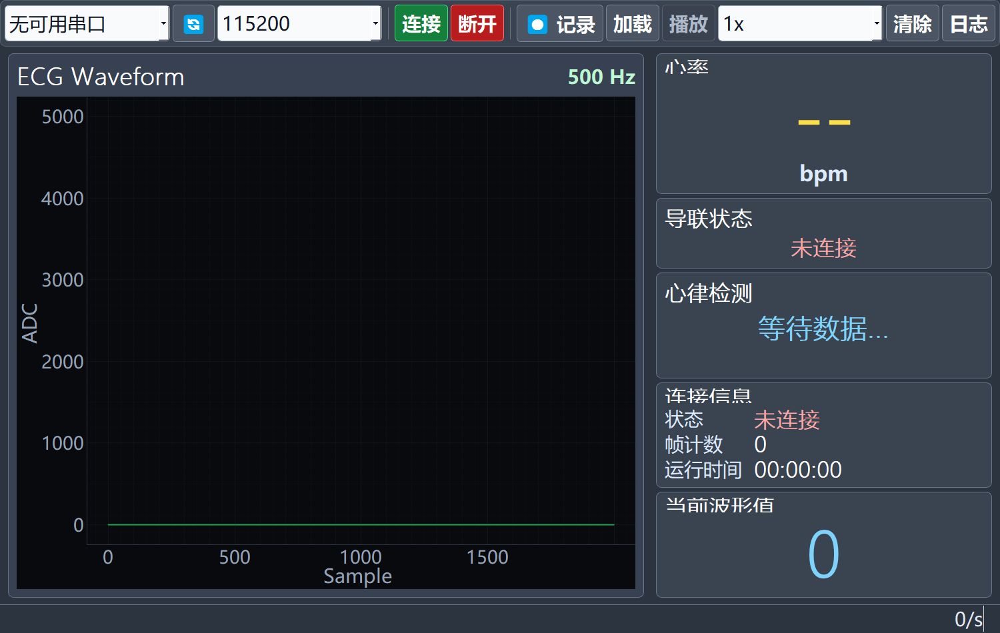
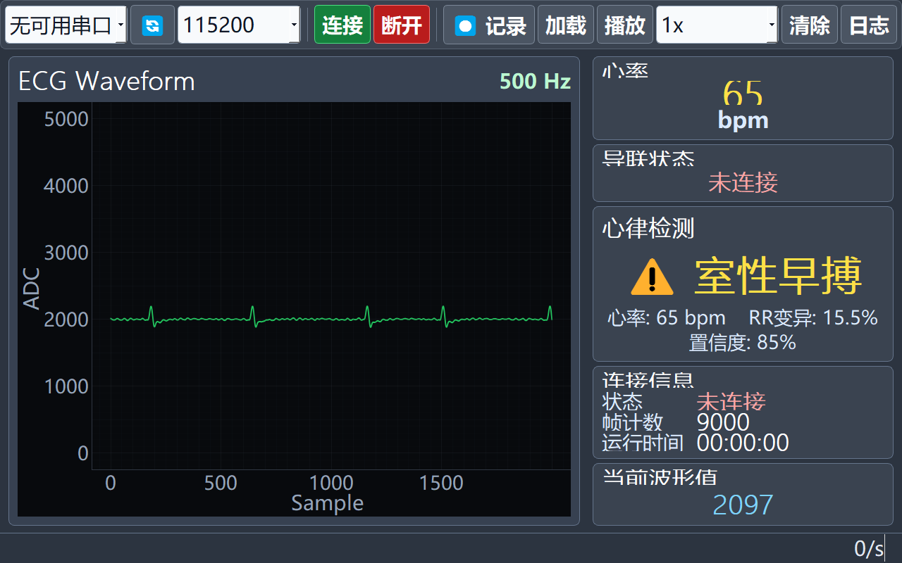

# ECG Monitor Desktop Host

A PyQt5 desktop application for receiving and displaying ECG data from a
compatible STM32 device. It supports live waveform display, serial
communication, CSV recording and playback, and experimental rhythm analysis.

> Educational prototype only. This software is not a medical device and must
> not be used for diagnosis, monitoring, treatment, or patient care.

## Features

- serial-port discovery and background data reception;
- checksum-verified 10-byte frame parser;
- real-time ECG waveform, heart-rate and lead-status display;
- CSV recording and offline playback;
- communication log;
- experimental rule-based rhythm analysis.

## Screenshots





## Run

Requires Python 3.9 or later.

```powershell
git clone https://github.com/sanhearwind/ecg-monitoring-software.git
cd ecg-monitoring-software
python -m venv .venv
.\.venv\Scripts\Activate.ps1
python -m pip install -r requirements.txt
python host\main.py
```

The application can run without connected hardware for interface inspection and
CSV playback. Live acquisition requires a device compatible with
[`docs/protocol.md`](docs/protocol.md).

## Structure

```text
host/    Desktop application
docs/    Architecture, protocol and screenshots
tests/   Protocol parser tests
```

## Scope

This repository contains only the independently developed desktop host,
documentation and tests. Course-provided firmware, hardware files and template
source are not included. The serial protocol is a pre-existing course interface
and is documented only for compatibility.

## License

GPL-3.0-only. See [`LICENSE`](LICENSE) and
[`THIRD_PARTY_NOTICES.md`](THIRD_PARTY_NOTICES.md).
